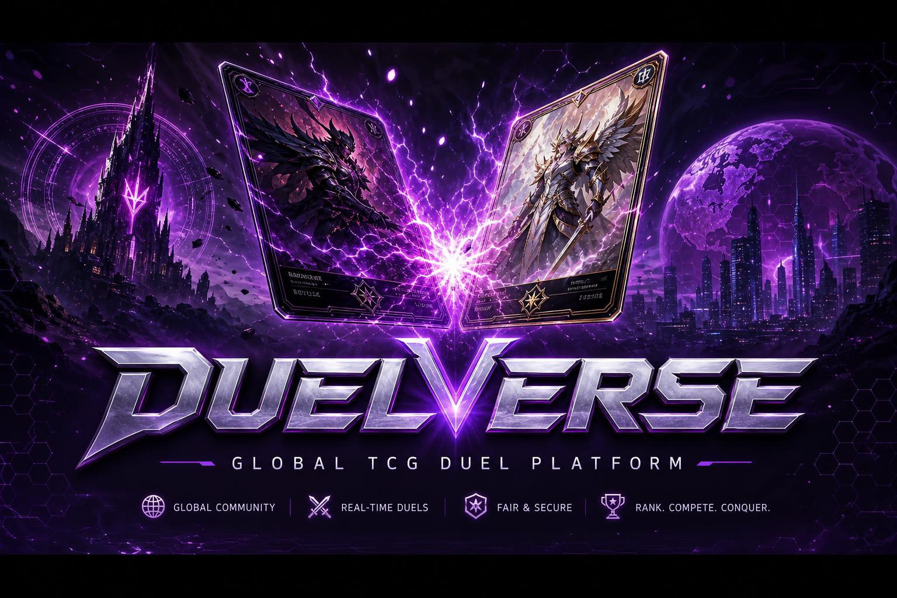
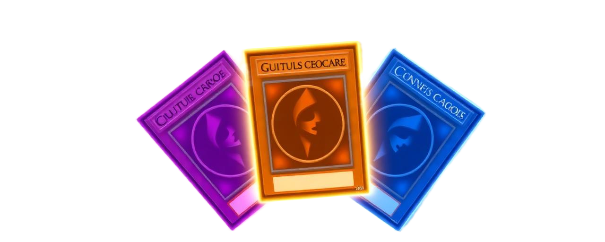

<div align="center">



<br/>

# 🃏 DuelVerse

### *Onde duelistas do mundo inteiro se encontram — frente a frente, mesmo a continentes de distância.*

[](https://duelverse.site)
[](https://duelverse.site)
[]()
[]()

<br/>

[**🚀 Jogar agora**](https://duelverse.site) · [**📖 Sobre o projeto**](#-a-filosofia) · [**🛠️ Stack**](#-stack-em-uma-olhada) · [**⚙️ Instalar local**](#-rodando-localmente) · [**✨ Roadmap**](#-para-onde-vamos)

</div>

---

## 🎯 A Filosofia

> *"Um TCG não é só sobre cartas. É sobre **quem está do outro lado da mesa**."*

O **DuelVerse** nasceu de uma frustração simples: simuladores são técnicos, frios, mecânicos. Eles funcionam — mas tiram o que torna um duelo presencial inesquecível. O olhar do oponente quando você ativa uma armadilha. O silêncio antes do summon decisivo. O aperto de mão no fim.

Em vez de simular, **conectamos**. Você joga com **suas próprias cartas físicas**, em videochamada com seu adversário, dentro de uma plataforma que cuida de tudo o que distrai do duelo: pontos de vida, timer, deck virtual de apoio, ranking, economia, torneios, premiação.

<div align="center">

### Três pilares. Uma visão.

</div>

| 🎭 **Presença** | 📈 **Progresso** | 🌍 **Comunidade** |
|:---:|:---:|:---:|
| Câmera, voz e cartas reais. <br/>O cenário digital nunca rouba o foco do duelo. | Cada partida vale algo: <br/>XP, DuelCoins, ranking, cosméticos. | Torneios semanais, juízes, <br/>chat global, amizades reais. |

---

## 🃏 Três Universos. Uma Mesa.

<div align="center">



</div>

| Formato | Estilo | Para quem é |
|---------|--------|-------------|
| 🟣 **YGO Advanced** | Competitivo principal — listas afiadas, meta vivo | Duelistas que querem testar deck contra o melhor que o mundo tem |
| 🟠 **Rush Duel** | Dinâmico e direto — partidas rápidas, decisões pesadas | Quem quer ação sem cerimônia |
| 🔵 **Genesis** | Formato lendário com regras próprias e curadoria de cartas | Quem ama nostalgia bem feita |

> **Política de perfil único:** uma conta = um TCG ativo. Rankings, decks e estatísticas vivem isolados. Quem joga Rush não polui o meta de Advanced — e vice-versa.

---

## ✨ O que torna o DuelVerse diferente

<table>
<tr>
<td width="50%" valign="top">

### 🎥 Sala de Duelo Imersiva
- Videochamada **WebRTC peer-to-peer** sem servidor de mídia no meio
- Servidores TURN OpenRelay como fallback NAT
- Timer compartilhado, calculadora flutuante de LP
- Chat de partida e gravação opcional

</td>
<td width="50%" valign="top">

### 🏆 Torneios Sérios
- **Suíço + Top 4** com pareamento automático
- **Torneios Semanais** com taxa, prize pool e premiação distribuída por edge function atômica
- Sistema de juízes com chamada dedicada e remuneração

</td>
</tr>
<tr>
<td width="50%" valign="top">

### 🤖 IA que Reconhece sua Lista
- Tire foto da decklist física
- Modelo multimodal Gemini identifica cada carta
- Lista pronta no construtor em segundos

</td>
<td width="50%" valign="top">

### 💰 Economia Justa
- **DuelCoins** como moeda interna — ganhas jogando
- Marketplace de itens cosméticos com aprovação curada
- Sleeves, playmats e ringtones personalizáveis

</td>
</tr>
<tr>
<td width="50%" valign="top">

### 🌎 16 Idiomas, Detecção Automática
- Português, Inglês, Espanhol, Francês, Alemão, Italiano,
- Japonês, Coreano, Chinês, Russo, Holandês, Polonês,
- Turco, Árabe, Indonésio
- Detecção por geolocalização + override manual

</td>
<td width="50%" valign="top">

### 📱 Em Qualquer Lugar
- **PWA** instalável em Android, iOS e Desktop
- App **Android nativo** via Capacitor (Play Store)
- App **Desktop Windows** via Electron + NSIS
- Todos com push notifications

</td>
</tr>
</table>

---

## 🎨 A Identidade Visual

A interface respira o ritual do duelo. Cada animação é uma escolha, não enfeite.

```
┌────────────────────────────────────────────────────────┐
│  🎴  Loader unificado: cartas caindo entre rotas       │
│  🌊  Fade-in + scale-in escalonados em listas e grids  │
│  🔮  Glow dinâmico em CTAs primários                   │
│  📜  Page-flip entre rotas (efeito de virada de carta) │
│  🎨  Tema HSL trocado em runtime conforme o TCG ativo  │
│  🎯  prefers-reduced-motion respeitado globalmente     │
└────────────────────────────────────────────────────────┘
```

**Paleta semântica:** todas as cores são tokens HSL em `src/index.css` — quando o duelista troca de TCG, o `<DynamicTheme />` reescreve as variáveis no `:root` e a UI inteira reage. Sem remontagem. Sem flicker.

```css
/* O coração do design system */
:root {
  --primary: 270 80% 55%;          /* roxo místico */
  --primary-glow: 270 90% 70%;
  --gradient-mystic: linear-gradient(135deg,
    hsl(var(--primary)) 0%,
    hsl(var(--accent)) 100%);
  --shadow-mystic: 0 10px 40px -10px hsl(var(--primary) / 0.5);
}
```

---

## 🛠️ Stack em uma olhada

<div align="center">

### Frontend


### Backend


### Mídia & Comunicação


### Distribuição


</div>

> Lista completa de dependências e versões em [`package.json`](./package.json).

---

## 🏛️ Arquitetura, Sem Mistério

```
       ┌──────────────────────────────────────────┐
       │     PWA  ·  Android  ·  Desktop          │
       └────────────────────┬─────────────────────┘
                            │  HTTPS · WSS · WebRTC
       ┌────────────────────▼─────────────────────┐
       │         React 18 · Vite · Tailwind       │
       │   Roteamento SPA · i18n (16 idiomas)     │
       │   Cache: TanStack Query · State: hooks   │
       └────────────────────┬─────────────────────┘
                            │
       ┌────────────────────▼─────────────────────┐
       │     PostgreSQL  +  Row-Level Security    │
       │     Auth · Realtime · Storage            │
       │     Edge Functions Deno (atômicas)       │
       └────────────────────┬─────────────────────┘
                            │
       ┌────────────────────▼─────────────────────┐
       │  WebRTC P2P · MercadoPago · Stripe       │
       │  Discord Bot (Java) · Gemini · MailerSend│
       └──────────────────────────────────────────┘
```

**Princípios não-negociáveis:**
- 🔒 RLS habilitado em **toda** tabela do schema `public`
- 🛡️ Roles em tabela separada (`user_roles`) com função `SECURITY DEFINER` — zero risco de escalada
- ⚛️ Operações financeiras **sempre** em RPC atômica com ledger
- 🚫 Zero cor hard-coded em componentes — só tokens semânticos
- ♿ `prefers-reduced-motion` respeitado, semântica HTML5, alt em tudo

---

## ⚙️ Rodando Localmente

### Pré-requisitos
```bash
node >= 18    npm >= 9    git
```

### Em três passos
```bash
# 1. Clonar
git clone https://github.com/vinicon14/duelverseremote.git
cd duelverseremote

# 2. Instalar
npm install

# 3. Rodar
npm run dev      # http://localhost:8080
```

### Variáveis de ambiente
Crie um `.env` baseado em `.env.example`:
```env
VITE_SUPABASE_URL=https://seu-projeto.supabase.co
VITE_SUPABASE_PUBLISHABLE_KEY=sua_chave_publica_anon
VITE_SUPABASE_PROJECT_ID=seu_project_id
```
> A chave `anon` do Supabase é pública por design — quem protege os dados é a RLS no banco.

### Scripts úteis

| Comando | O que faz |
|---------|-----------|
| `npm run dev` | Dev server com HMR em `:8080` |
| `npm run build` | Build de produção em `dist/` |
| `npm run preview` | Serve o build localmente |
| `npm run lint` | Roda ESLint |
| `npm run package:win` | Empacota app Windows (Electron) |
| `npm run installer:win` | Gera instalador `.exe` (NSIS) |
| `npx cap sync android` | Sincroniza projeto Android |
| `npx cap open android` | Abre Android Studio |

---

## 📂 Anatomia do Projeto

```
duelverseremote/
├── 🎨 src/
│   ├── components/        Componentes React (UI, duelo, admin, builder)
│   ├── pages/             Rotas (Home, DuelRoom, Auth, Admin, Tournaments…)
│   ├── hooks/             Custom hooks (useTcg, useDuelDeck, useAdmin…)
│   ├── contexts/          Providers globais (TcgContext)
│   ├── i18n/              16 locales + detecção por país
│   ├── integrations/      Cliente Supabase (auto-gerado)
│   └── utils/             Helpers puros (sfx, push, plataforma)
│
├── 🛢️ supabase/
│   ├── functions/         Edge Functions Deno
│   ├── config.toml        Config do projeto Supabase
│   └── migrations/        Histórico SQL versionado
│
├── 📱 android/            Projeto Capacitor (Play Store ready)
├── 🖥️ electron/           App desktop (Windows/macOS/Linux)
└── 📦 public/             Assets estáticos + manifest PWA
```

---

## 🚀 Para onde vamos

| Horizonte | Foco |
|-----------|------|
| 🎯 **Curto prazo** (3-6 meses) | Estabilizar a experiência core. Reduzir fricção do primeiro duelo. |
| 🌱 **Médio prazo** (6-12 meses) | Novos formatos, modo espectador profissional, parcerias com lojas físicas. |
| 🌌 **Longo prazo** (1+ ano) | Ecossistema completo: criadores de conteúdo, marketplace expandido, eventos presenciais híbridos. |

---

## 🤝 Contribuindo

PRs e issues são bem-vindos. Antes de começar:

1. Abra uma issue para alinhar escopo
2. Respeite o design system (tokens HSL, sem cores cruas)
3. Inclua testes ao mexer em lógica crítica de duelo ou economia
4. Descreva problema **e** solução com clareza

---

<div align="center">

## 💜 Feito por um duelista, para duelistas.

**Vinícius** · [duelverse.app@gmail.com](mailto:duelverse.app@gmail.com) · [duelverse.site](https://duelverse.site)

> *Cada decisão de produto passa primeiro pela mesa de jogo.*

<br/>


</div>
