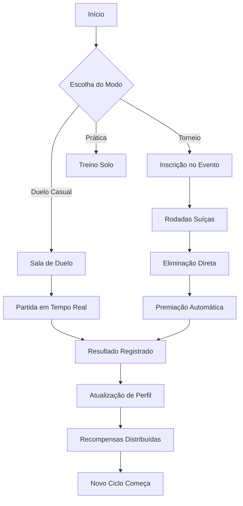
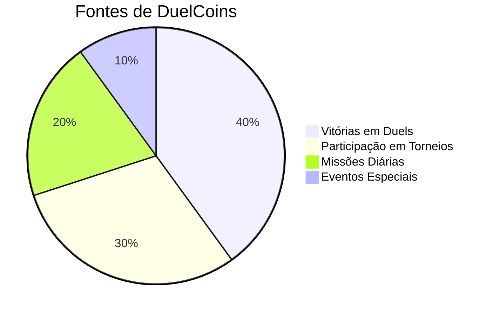

# DuelVerse - Plataforma de Duelos Online

Plataforma completa para duelistas de TCG que buscam competir remotamente com experiência presencial. Combine videochamadas, economia virtual e torneios estruturados em um único ambiente.

(https://raw.githubusercontent.com/vinicon14/duelverseremote/main/favicon.ico)](https://duelverse.site)

## Sumário

- [Conceito Central](#conceito-central)
- [Como Funciona](#como-funciona)
- [Experiência do Usuário](#experiência-do-usuário)
- [Mecânicas Principais](#mecânicas-principais)
- [Tecnologias Utilizadas](#tecnologias-utilizadas)
- [Animações e Efeitos Visuais](#animações-e-efeitos-visuais)
- [Guia de Instalação](#guia-de-instalação)
- [Contato](#contato)
- [Visão Futura](#visão-futura)

---

## Conceito Central

DuelVerse nasceu da necessidade de manter a essência dos duels presenciais no ambiente digital. Em vez de simplesmente replicar mecânicas de jogo, focamos em três pilares fundamentais:

| Pilar | Descrição | Benefício para o Usuário |
|-------|-----------|--------------------------|
| Presença | Sensação de estar frente a frente com o oponente | Reduz a distância emocional do jogo online |
| Progresso | Sistema de evolução reconhecendo dedicação e habilidade | Motivação contínua para melhorar |
| Comunidade | Espaço seguro para conexão entre duelistas | Pertencimento e engajamento de longo prazo |

---

## Como Funciona (Fluxo Conceitual)



### Elementos-Chave do Fluxo:
1. **Início**: Sempre acessível através da página inicial intuitiva
2. **Escolha do Modo**: Três caminhos principais baseados no objetivo do jogador
3. **Processo**: Cada modo segue um caminho estruturado com pontos de validação
4. **Conclusão**: Resultados alimentam o sistema de progresso para futuras partidas

---

## Experiência do Usuário por Perfil

### Para o Novo Jogador
- Boas-vindas guiada com tutoriais interativos
- Salas de treinamento sem pressão competitiva
- Sistema de correspondência baseado em nível semelhante
- Feedback imediato após cada partida

### Para o Jogador Regular
- Histórico detalhado de desempenho
- Desafios diários para habilidade específica
- Leaderboards regionais e globais
- Eventos comunitários regulares

### Para o Organizador/Torneio
- Criação simplificada de eventos com templates
- Ferramentas de moderação embutidas
- Distribuição automática de prêmios
- Relatórios completos pós-evento

---

## Mecânicas Principais (Abordagem Conceitual)

### Sistema de Duelo
```
[Preparação] 
    ↓
[Conexão] ←→ [Sincronização de Estado]
    ↓
[Interação] ←→ [Comunicação em Tempo Real]
    ↓
[Resolução] ←→ [Validação de Jogada]
    ↓
[Conclusão] ←→ [Registro de Resultado]
```

### Economia Virtual


### Progressão de Habilidade
```
Iniciante → Aprendiz → Competente → Expert → Mestre → Lenda
    ↑                                       ↓
    └────────────── Sistema de Matchmaking ──────────────┘
```

---

## Tecnologias Utilizadas

### Frontend
- **React 18.3**: Biblioteca JavaScript para construção de interfaces de usuário
- **TypeScript 5.8**: Superset tipado do JavaScript para desenvolvimento seguro
- **Vite 5.4**: Ferramenta de build rápida para desenvolvimento moderno
- **Tailwind CSS 3.4**: Framework CSS utilitário para styling eficiente
- **Headless UI/Radix**: Componentes acessíveis e não estilizados

### Backend e Infraestrutura
- **Supabase**: Plataforma de backend como serviço (PostgreSQL, Auth, Realtime, Edge Functions)
- **PostgreSQL**: Banco de dados relacional para armazenamento de informações
- **Supabase Realtime**: Sincronização de dados em tempo real entre clientes

### Desktop e Mobile
- **Electron 41.1**: Framework para aplicações desktop cross-platform
- **Capacitor 8.2**: Plataforma para aplicações nativas mobile
- **PWA (Progressive Web App)**: Experiência de aplicativo através do navegador

### Comunicação e Mídia
- **Daily.co SDK**: Integração de videochamadas de alta qualidade
- **WebRTC**: Tecnologia subjacente para comunicação peer-to-peer
- **Socket.io**: Comunicação em tempo real para funcionalidades específicas

### Estado e Cache
- **TanStack Query 5.83**: Gerenciamento estado do servidor e cache
- **React Query**: Sincronização de estado entre cliente e servidor

### Internacionalização
- **i18next 26.0**: Framework para internacionalização de aplicações
- **Browser Language Detector**: Detecção automática de idioma do navegador

### Formulários e Validação
- **React Hook Form 7.61**: Gerenciamento performático de formulários
- **Zod 3.25**: Validação de esquema TypeScript-first
- **React Select 2.2**: Componente select personalizável e acessível

### UI/UX e Componentes
- **Lucide React 0.462**: Conjunto de ícones consistentes e leves
- **Sonner 1.7**: Sistema de notificações toast moderno
- **Recharts 2.15**: Biblioteca de gráficos construída sobre React e D3
- **Embla Carousel 8.6**: Carousel touch-enabled performático
- **Date-fns 3.6**: Biblioteca moderna para manipulação de datas

### Desenvolvimento e Qualidade
- **ESLint 9.32**: Linter para identificação e correção de problemas no código
- **TypeScript-ESSLint 8.38**: Integração entre TypeScript e ESLint
- **Vitest**: Framework de teste rápido e moderno
- **Playwright**: Testes end-to-end para aplicações web
- **Biome**: Ferramenta de formatação e linting unificada

---

## Animações e Efeitos Visuais

DuelVerse utiliza uma abordagem sofisticada para animações que melhora a experiência do usuário sem comprometer o desempenho:

### Sistema de Animações Base
- **CSS Variables**: Todas as animações utilizam variáveis CSS para consistência temática
- **Prefere-reduced-motion**: Respeito às configurações de acessibilidade do sistema
- **Hardware Aceleration**: Utilização de transform e opacity para animações suaves

### Tipos de Animações Implementadas
1. **Transições de Página**: Fade-in, slide-in, scale-in com delays escalonados
2. **Elementos Flutuantes**: Animações de flutuação suave para elementos decorativos
3. **Efeitos de Hover**: Transições sutis em botões e cards interativos
4. **Indicadores de Loading**: Spinners e shimmers personalizados
5. **Animações de Lista**: Stagger reveal para grids e listas de conteúdo
6. **Efeitos de Glow e Pulse**: Iluminação dinâmica para elementos de destaque
7. **Transições de Estado**: Mudanças suaves entre diferentes estados de UI

### Bibliotecas Utilizadas
- **CSS Animations nativas**: Para máximo desempenho e controle
- **Framer Motion** (em alguns componentes): Para animações complexas quando necessário
- **Animate.css** (seletivamente): Para efeitos pré-definidos de uso comum

### Otimizações de Performance
- **will-change**: Otimização para propriedades animadas frequentemente
- **contain**: Isolamento de elementos animados para reduzir reflows
- **requestAnimationFrame**: Sincronização com o ciclo de atualização da tela
- **Debounce e Throttle**: Controle de frequência para animações baseadas em scroll

---

## Guia de Instalação

### Pré-requisitos

Antes de começar, certifique-se de ter instalado:
- Node.js versão 18.0 ou superior
- npm versão 9.0 ou superior (ou yarn/pnpm)
- Git para controle de versão
- Supabase account (para configurar o backend)

### Passo a Passo

#### 1. Clonagem do Repositório
```bash
git clone https://github.com/vinicon14/duelverseremote.git
cd duelverseremote
```

#### 2. Instalação de Dependências
```bash
npm install
```

#### 3. Configuração do Ambiente
Crie um arquivo `.env` na raiz do projeto baseado no `.env.example`:

```env
VITE_SUPABASE_URL=seu_projeto.supabase.co
VITE_SUPABASE_PUBLISHABLE_KEY=sua_chave_anon
```

> **Importante**: Nunca commit seu arquivo `.env` público. Mantenha suas credenciais seguras.

#### 4. Inicialização do Servidor de Desenvolvimento
```bash
npm run dev
```

O aplicativo estará disponível em http://localhost:8080

#### 5. Build para Produção
```bash
npm run build
```

Os arquivos de produção serão gerados no diretório `dist/`

#### 6. Visualização da Build de Produção
```bash
npm run preview
```

### Scripts Disponíveis

| Script | Descrição |
|--------|-----------|
| `npm run dev` | Inicia o servidor de desenvolvimento com hot reload |
| `npm run build` | Cria a versão de produção otimizada |
| `npm run preview` | Visualiza a build de produção localmente |
| `npm run lint` | Executa o ESLint para verificação de código |
| `npm run package:win` | Cria pacote instalável para Windows (Electron) |
| `npm run installer:win` | Cria instalador Windows usando NSIS |

### Variáveis de Ambiente Necessárias

| Variável | Descrição | Obrigatório |
|----------|-----------|-------------|
| VITE_SUPABASE_URL | URL do projeto Supabase | Sim |
| VITE_SUPABASE_PUBLISHABLE_KEY | Chave pública anonima do Supabase | Sim |
| VITE_GOOGLE_API_KEY | Chave da API do Google Translate (opcional) | Não |
| VITE_DAILY_CO_KEY | Chave da API do Daily.co para videochamadas | Sim (para funcionalidade completa) |

### Docker (Alternativa)

Para desenvolvimento usando containers:
```bash
# Construir a imagem
docker build -t duelverse .

# Executar o container
docker run -p 8080:80 duelverse
```

### Solução de Problemas Comuns

#### Erro de Dependências
Se encontrar problemas com dependências:
```bash
rm -rf node_modules package-lock.json
npm install
```

#### Porta já em uso
Se a porta 8080 estiver ocupada:
```bash
# Alterar a porta temporariamente
npm run dev -- --port 3000
```

#### Problemas de Build
Limpar cache de build:
```bash
npm run build -- --emptyOutDir
```

---

## Contato

**Email oficial**: duelverse.app@gmail.com  
**Website**: https://duelverse.site  
**Suporte**: Resposta em até 24 horas úteis  

Para relatar bugs, sugerir funcionalidades ou contribuir com o projeto, por favor utilize o sistema de Issues do GitHub.

---

## Visão Futura

DuelVerse vê além do simples jogo online. Nosso roadmap conceitual inclui:

| Horizonte | Foco | Objetivo |
|-----------|------|----------|
| **Curto Prazo** (3-6 meses) | Estabilização da experiência core | Reduzir friction para novos usuários |
| **Médio Prazo** (6-12 meses) | Expansão de modos de jogo | Incluir formatos alternativos e colaborativos |
| **Longo Prazo** (1+ ano) | Ecossistema integrado | Conectar duelistas, criadores de conteúdo e lojas físicas |

### Principais Objetivos de Desenvolvimento
1. **Mobile First Experience**: Otimização completa para dispositivos móveis
2. **Integração com Mercados Parceiros**: Conectar com lojas físicas e online de TCG
3. **Modo Espectador Avançado**: Recursos para transmissão e comentários de duelos
4. **Sistema de Clãs e Guildas**: Comunidades estruturadas para colaboração de longo prazo
5. **Mercado NFT Integrado**: Criação e troca de colecionáveis digitais exclusivos

*Última atualização: Abril de 2026*  
*Desenvolvido com foco na experiência humana por trás de cada carta virada.*
