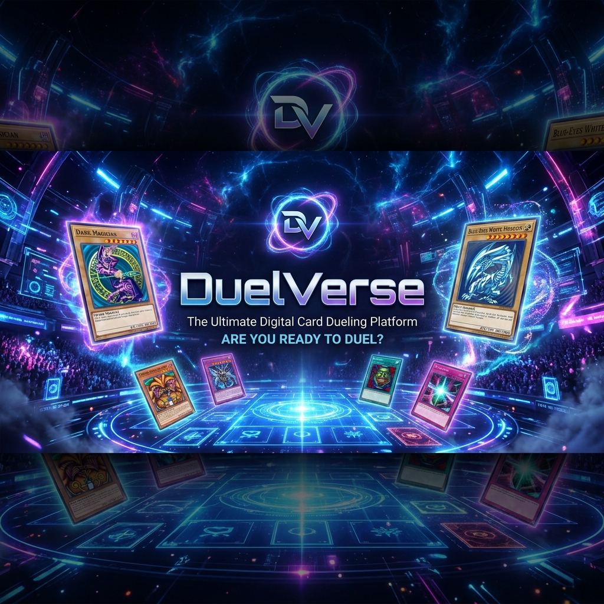

# 🂡 DuelVerse - Plataforma de Duelos Online Yu-Gi-Oh!

<p align="center">
  
</p>

<p align="center">
  <a href="https://vitejs.dev/">
    
  </a>
  <a href="https://reactjs.org/">
    
  </a>
  <a href="https://www.typescriptlang.org/">
    
  </a>
  <a href="https://supabase.com/">
    
  </a>
  <a href="https://opensource.org/licenses/MIT">
    
  </a>
</p>

---

<p align="center">
  <strong>DuelVerse</strong> é um ecossistema digital completo projetado para duelistas de Yu-Gi-Oh! que buscam a experiência competitiva definitiva. Unindo videochamadas em tempo real, economia virtual e um sistema robusto de torneios, levamos o duelo físico para o ambiente remoto com perfeição.
</p>

<p align="center">
  <a href="#-funcionalidades">Funcionalidades</a> •
  <a href="#-tecnologias">Tecnologias</a> •
  <a href="#-como-executar-localmente">Instalação</a> •
  <a href="#-contato--suporte">Contato</a>
</p>

---

## 🚀 O que torna o DuelVerse Único?

| 🗡️ Duelos Sincronizados | 🎥 Videochamada Integrada | 🏆 Torneios Automáticos |
| :--- | :--- | :--- |
| Partidas em tempo real via Supabase Realtime, garantindo latência mínima. | Integração nativa com Daily.co para comunicação face-a-face durante o jogo. | Sistema de Swiss Rounds e distribuição automática de premiações. |

---

## ✨ Funcionalidades em Destaque

<details>
<summary><b>🎮 Experiência de Jogo</b></summary>
<ul>
  <li><b>Salas de Duelo:</b> Criação instantânea com suporte a observadores.</li>
  <li><b>Calculadora LP:</b> Interface flutuante e arrastável inspirada em interfaces modernas de jogos.</li>
  <li><b>Chat Realtime:</b> Comunicação integrada para coordenação de jogadas.</li>
  <li><b>Timer de Duelo:</b> Controle rigoroso de tempo para ambiente competitivo.</li>
</ul>
</details>

<details>
<summary><b>🃏 Deck Builder & IA</b></summary>
<ul>
  <li><b>Busca Inteligente:</b> Acesso à base de dados completa de cartas.</li>
  <li><b>Reconhecimento de Cartas:</b> Upload de imagens para identificação automática via IA.</li>
  <li><b>Gestão de Decks:</b> Exporte, importe e organize seus decks com facilidade.</li>
</ul>
</details>

<details>
<summary><b>💰 Economia & Social</b></summary>
<ul>
  <li><b>DuelCoins:</b> Ganhe moedas em duelos e torneios.</li>
  <li><b>Loja Virtual:</b> Adquira assinaturas Pro e cosméticos exclusivos.</li>
  <li><b>Sistema de Amigos:</b> Veja quem está online e convide para um duelo direto.</li>
</ul>
</details>

---

## 🛠️ Stack Tecnológica

<p align="left">
  
</p>

- **Frontend:** React + TypeScript + Tailwind CSS
- **Backend:** Supabase (Auth, DB, Realtime, Edge Functions)
- **Desktop:** Electron (Integração desktop)
- **Vídeo:** Daily.co SDK
- **Mobile:** Capacitor (Suporte Android/iOS)

---

## 📁 Estrutura de Pastas

```bash
duelverseremote/
├── 📱 android/          # Código nativo Android (Capacitor)
├── ⚡ electron/         # Main process e builds desktop
├── 🗄️ supabase/         # Edge Functions e schemas do banco
├── 🧪 database/         # Scripts de migração SQL
└── ⚛️ src/
    ├── 🧩 components/   # UI Reutilizável (shadcn/ui)
    ├── 📄 pages/        # Visões da aplicação
    ├── 🎣 hooks/        # Lógica React desacoplada
    └── 🔗 integrations/ # Configurações de serviços externos
```

---

## 🚀 Como Executar Localmente

### 1. Preparação do Ambiente

Certifique-se de ter o **Node.js 18+** e o **npm/yarn** instalados.

### 2. Instalação

```bash
# Clone o repositório
git clone https://github.com/vinicon14/duelverseremote.git

# Entre no diretório
cd duelverseremote

# Instale as dependências
npm install
```

### 3. Configuração

Renomeie o arquivo `.env.example` para `.env` e preencha suas credenciais do Supabase:

```env
VITE_SUPABASE_URL=seu_projeto.supabase.co
VITE_SUPABASE_PUBLISHABLE_KEY=sua_chave_anon
```

### 4. Rodando o Projeto

```bash
npm run dev
```

Acesse em `http://localhost:8080` e que os duelos comecem!

---

## 💎 Vantagens do Plano Pro

| Benefício | Free | Pro |
| :--- | :---: | :---: |
| Duelos Ilimitados | ✅ | ✅ |
| Torneios Premium | ❌ | ✅ |
| Sem Anúncios | ❌ | ✅ |
| Badge Exclusiva | ❌ | ✅ |
| Suporte Prioritário | ❌ | ✅ |

---

## 🤝 Contribuição

Sua ajuda é muito bem-vinda! Siga o fluxo abaixo:

1. 🍴 **Fork** o projeto
2. 🌿 Crie sua **Branch** (`git checkout -b feature/AmazingFeature`)
3. 💾 **Commit** suas mudanças (`git commit -m 'Add some AmazingFeature'`)
4. 🚀 **Push** para a Branch (`git push origin feature/AmazingFeature`)
5. ⤴️ Abra um **Pull Request**

---

## 📞 Contato & Suporte

<p align="left">
<a href="https://github.com/vinicon14" target="blank"></a>
<a href="https://duelverse.com.br" target="blank"></a>
</p>

Desenvolvido por **Vinícius**.

---

## 📄 Licença

Este projeto está sob a licença MIT. Veja o arquivo [LICENSE](LICENSE) para mais detalhes.

<p align="center">
  
</p>