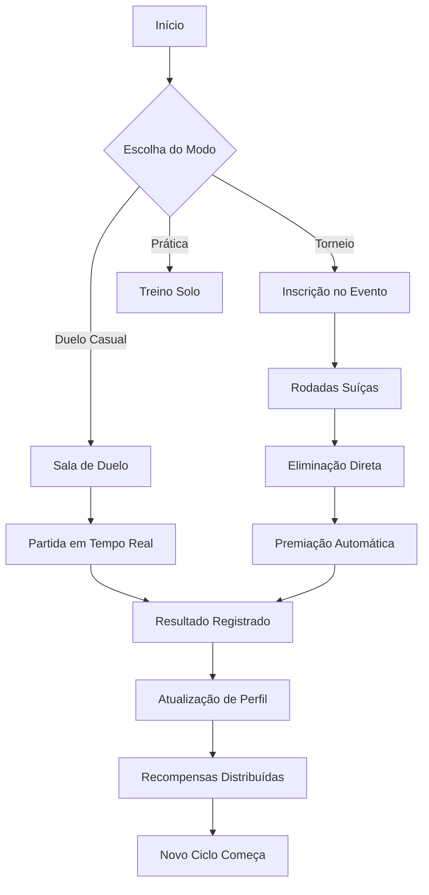
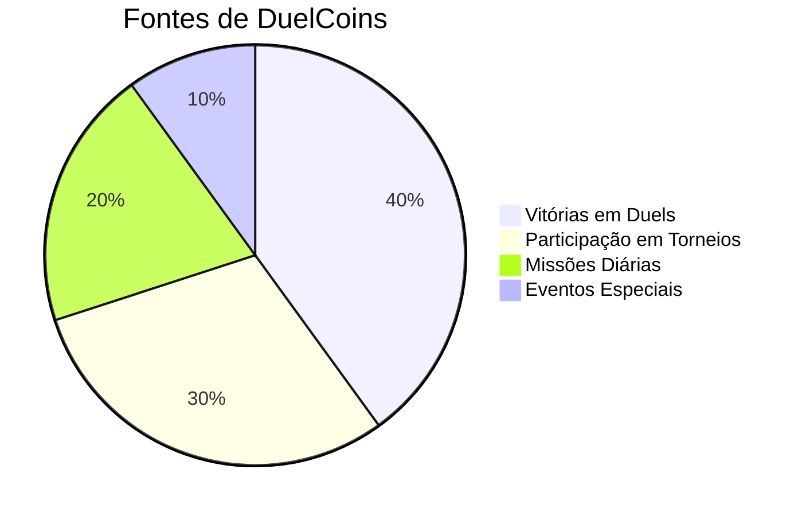

# 🎮 DuelVerse - Plataforma de Duelos Online

<p align="center">
  
</p>

<p align="center">
  Plataforma completa para duelistas de TCG que buscam competir remotamente com experiência presencial. Combine videochamadas, economia virtual e torneios estruturados em um único ambiente.
</p>

<p align="center">
  <a href="#-como-funciona">Como Funciona</a> •
  <a href="#-experiência-do-usuário">Experiência</a> •
  <a href="#-contato">Contato</a>
</p>

---

## 🎯 Conceito Central

DuelVerse nasceu da necessidade de manter a essência dos duels presenciais no ambiente digital. Em vez de simplesmente replicar mecânicas de jogo, focamos em três pilares fundamentais:

| Pilar | Descrição | Benefício para o Usuário |
|-------|-----------|--------------------------|
| **Presença** | Sensação de estar frente a frente com o oponente | Reduz a distância emocional do jogo online |
| **Progresso** | Sistema de evolução reconhecendo dedicação e habilidade | Motivação contínua para melhorar |
| **Comunidade** | Espaço seguro para conexão entre duelistas | pertencimento e engajamento de longo prazo |

---

## 🔄 Como Funciona (Fluxo Conceitual)



### Elementos-Chave do Fluxo:
1. **Início**: Sempre acessível através da página inicial intuitiva
2. **Escolha do Modo**: Três caminhos principais baseados no objetivo do jogador
3. **Processo**: Cada modo segue um caminho estruturado com pontos de validação
4. **Conclusão**: Resultados alimentam o sistema de progresso para futuras partidas

---

## 👥 Experiência do Usuário por Perfil

### Para o Novo Jogador
- Boas-vindas guiada com tutoriais interativos
- Salas de treinamento sem pressão competitiva
- Sistema de correspondência baseado em nível semelhante
- Feedback imediato após cada partida

### Para o Jogador Regular
- Histórico detalhado de desempenho
- Desafios diários para habilidade específica
- Leaderboards regionais e globais
- Eventos comunitários regulares

### Para o Organizador/Torneio
- Criação simplificada de eventos com templates
- Ferramentas de moderação embutidas
- Distribuição automática de prêmios
- Relatórios completos pós-evento

---

## ⚙️ Mecânicas Principais (Abordagem Conceitual)

### Sistema de Duelo
```
[Preparação] 
    ↓
[Conexão] ←→ [Sincronização de Estado]
    ↓
[Interação] ←→ [Comunicação em Tempo Real]
    ↓
[Resolução] ←→ [Validação de Jogada]
    ↓
[Conclusão] ←→ [Registro de Resultado]
```

### Economia Virtual


### Progressão de Habilidade
```
Iniciante → Aprendiz → Competente → Expert → Mestre → Lenda
    ↑                                       ↓
    └────────────── Sistema de Matchmaking ──────────────┘
```

---

## 📞 Contato

<p align="left">
  <a href="mailto:duelverse.app@gmail.com" target="blank"></a>
  <a href="https://duelverse.site" target="blank"></a>
</p>

**Email oficial**: duelverse.app@gmail.com  
**Website**: https://duelverse.site  
**Suporte**: Resposta em até 24 horas úteis

---

## 🌱 Visão Futura

DuelVerse vê além do simples jogo online. Nosso roadmap conceitual inclui:

| Horizonte | Foco | Objetivo |
|-----------|------|----------|
| **Curto Prazo** (3-6 meses) | Estabilização da experiência core | Reduzir friction para novos usuários |
| **Médio Prazo** (6-12 meses) | Expansão de modos de jogo | Incluir formatos alternativos e colaborativos |
| **Longo Prazo** (1+ ano) | Ecossistema integrado | Conectar duelistas, criadores de conteúdo e lojas físicas |

---

*Última atualização: Abril 2026*  
*Desenvolvido com foco na experiência humana por trás de cada carta virada.*