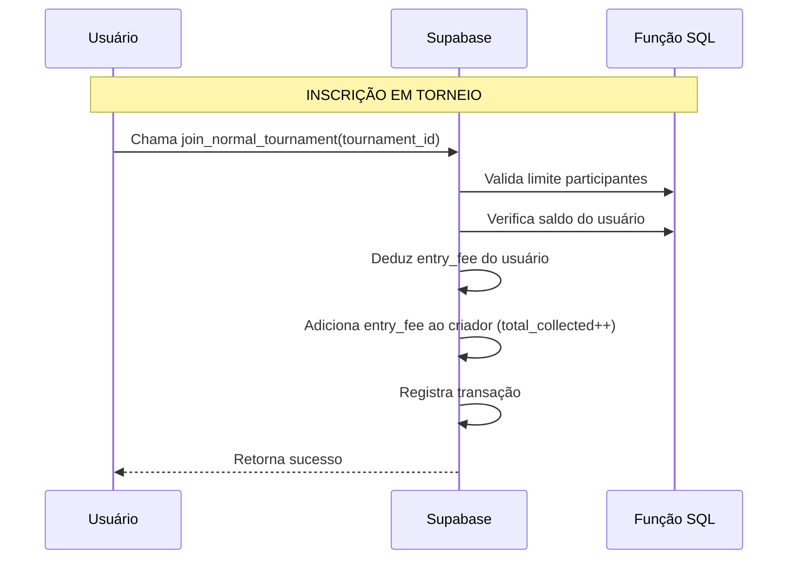
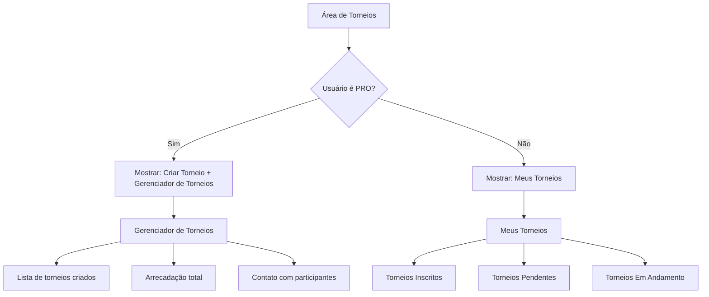
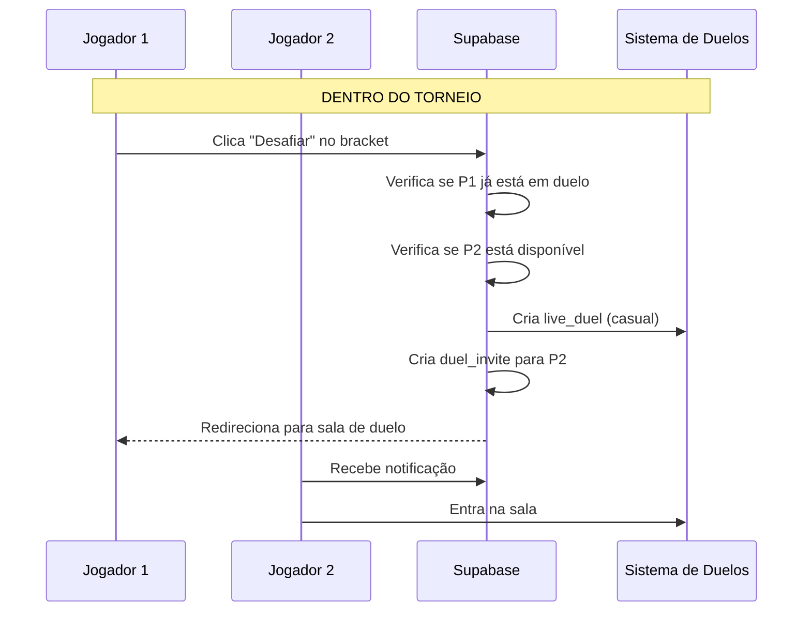

# Plano de Aprimoramento do Sistema de Torneios

## Visão Geral

Este documento detalha o plano para:
1. Adicionar sistema de pagamentos/arrecadações aos torneios normais
2. Criar interfaces diferenciadas para PRO e FREE users
3. Adicionar funcionalidade de desafio entre oponentes de torneio

---

## FASE 1: Sistema de Pagamentos Unificado

### 1.1 Colunas da Tabela `tournaments`

```sql
-- Já existem na weekly_tournament_system.sql:
ALTER TABLE tournaments ADD COLUMN IF NOT EXISTS is_weekly BOOLEAN DEFAULT FALSE;
ALTER TABLE tournaments ADD COLUMN IF NOT EXISTS total_collected DECIMAL DEFAULT 0;
ALTER TABLE tournaments ADD COLUMN IF NOT EXISTS prize_paid BOOLEAN DEFAULT FALSE;
```

### 1.2 Fluxo de Pagamento



### 1.3 Funções SQL a Criar

#### `join_normal_tournament(p_tournament_id UUID)`
- Valida que o torneio existe e está aberto (`status = 'upcoming'`)
- Verifica limite de participantes
- Cobra taxa de inscrição do participante
- Adiciona taxa ao `total_collected` do criador
- Registra na `tournament_participants`

#### `create_normal_tournament(...)`
- Similar ao `create_weekly_tournament`
- Deduz `prize_pool` do saldo do criador
- Define `is_weekly = FALSE`

#### `distribute_normal_tournament_prize(p_tournament_id, p_winner_id)`
- Similar ao `distribute_weekly_tournament_prize`
- Adiciona `prize_pool` ao vencedor
- Atualiza `prize_paid = TRUE`

---

## FASE 2: Interfaces Diferenciadas por Usuário

### 2.1 Fluxo de Navegação



### 2.2 Componentes a Criar

#### `MyTournaments.tsx` (FREE Users)
```typescript
interface MyTournamentsProps {
  userId: string;
}

interface MyTournament {
  id: string;
  name: string;
  status: 'upcoming' | 'active' | 'completed';
  currentRound?: number;
  opponentId?: string;
  opponentUsername?: string;
}
```

**Funcionalidades:**
- Aba "Inscritos": Torneios que o usuário se inscreveu
- Aba "Pendentes": Torneios aguardando início
- Aba "Em Andamento": Torneios ativos com partidas
- Botão "Desafiar" ao lado de cada partida

#### `TournamentManager.tsx` (PRO Users)

```typescript
interface TournamentManagerProps {
  userId: string;
}

interface ManagedTournament {
  id: string;
  name: string;
  status: string;
  participantCount: number;
  totalCollected: number;
  participants: {
    userId: string;
    username: string;
    isOnline: boolean;
  }[];
}
```

**Funcionalidades:**
- Lista de torneios criados
- Arrecadação por torneio e total
- Botão de chat para cada participante
- Status de pagamento de prêmios

---

## FASE 3: Desafio Entre Oponentes

### 3.1 Fluxo de Desafio



### 3.2 Função SQL `get_tournament_opponents`

```sql
CREATE OR REPLACE FUNCTION get_tournament_opponents(
  p_tournament_id UUID,
  p_user_id UUID
)
RETURNS JSON AS $$
BEGIN
  RETURN (
    SELECT json_agg(
      json_build_object(
        'opponent_id', tm.player2_id,
        'opponent_username', p2.username,
        'match_id', tm.id,
        'round', tm.round,
        'status', tm.status
      )
    )
    FROM tournament_matches tm
    LEFT JOIN profiles p2 ON p2.user_id = tm.player2_id
    WHERE tm.player1_id = p_user_id
      AND tm.tournament_id = p_tournament_id
      AND tm.status = 'pending'
    
    UNION ALL
    
    SELECT json_agg(
      json_build_object(
        'opponent_id', tm.player1_id,
        'opponent_username', p1.username,
        'match_id', tm.id,
        'round', tm.round,
        'status', tm.status
      )
    )
    FROM tournament_matches tm
    LEFT JOIN profiles p1 ON p1.user_id = tm.player1_id
    WHERE tm.player2_id = p_user_id
      AND tm.tournament_id = p_tournament_id
      AND tm.status = 'pending'
  );
END;
$$ LANGUAGE plpgsql;
```

---

## Resumo das Alterações

### Arquivos a Criar/Modificar

| Arquivo | Tipo | Descrição |
|---------|------|-----------|
| `database/tournament_system.sql` | SQL | Novas funções para pagamentos |
| `src/pages/MyTournaments.tsx` | React | Página para FREE users |
| `src/pages/TournamentManager.tsx` | React | Página para PRO users |
| `src/pages/Tournaments.tsx` | React | Adicionar botões condicionais |
| `src/components/tournament/TournamentBracket.tsx` | React | Componente de bracket com desafio |
| `supabase/functions/charge-tournament-entry-fee/` | Edge Function | Atualizar para usar nova função |

### SQL Functions

| Função | Descrição |
|--------|-----------|
| `join_normal_tournament` | Inscrição com cobrança |
| `create_normal_tournament` | Criação com dedução de prize pool |
| `distribute_normal_tournament_prize` | Pagamento de prêmio |
| `get_tournament_opponents` | Buscar oponentes para desafio |

---

## Próximos Passos

1. **Criar arquivo SQL** com as funções de pagamento
2. **Atualizar componente `Tournaments.tsx`** para mostrar botões condicionais
3. **Criar página `MyTournaments.tsx`** para usuários FREE
4. **Criar página `TournamentManager.tsx`** para usuários PRO
5. **Adicionar funcionalidade de desafio** no bracket
6. **Testar fluxo completo** de inscrição e pagamento
